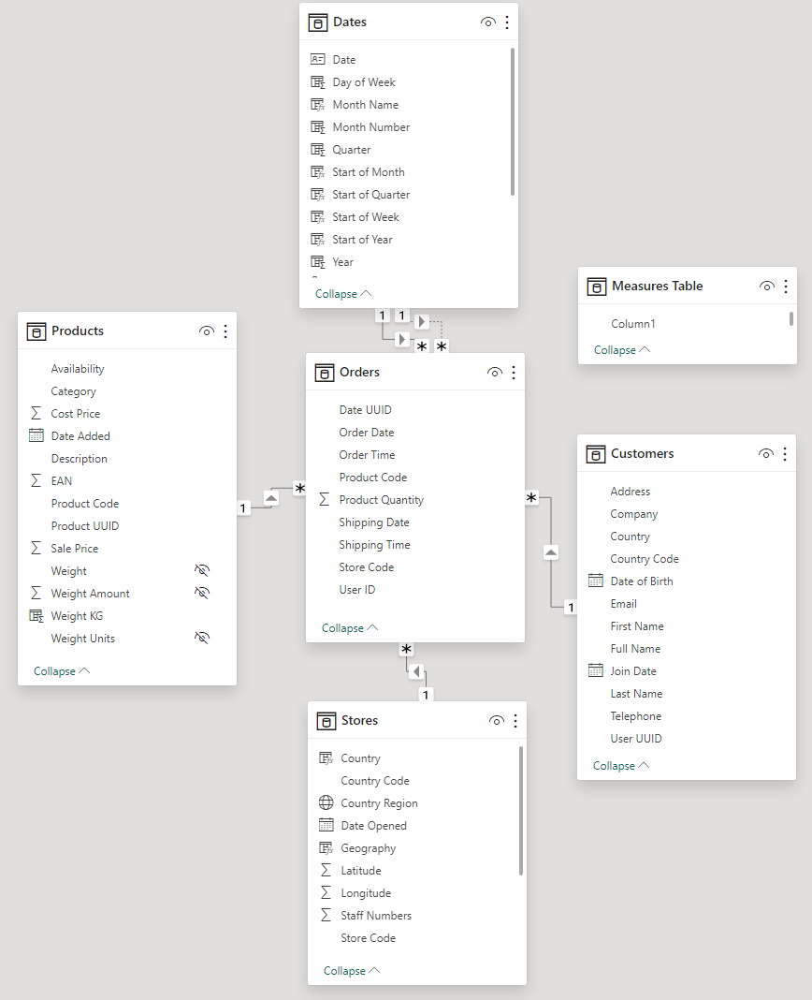

## Project Description

## Project Stages

### 1. Data Imports
Each of the tables *Orders*, *Products*, *Stores*, and *Customers* is imported into the Power BI project from a different source.

- The *Orders* table is imported from the Azure SQL Database using import mode. 

- The *Produts* table is imported from a local csv file.
- The *Stores* table is imported via an Azure Blob Sorage url. 
- The *Customers* table is imported by from a local folder containing three csv files which are combined into a single query. 

### 2. Data Transformations
The Power Query Editor is used to transform elements of each table before loading. 
#### Orders table:
- Each of the columns *Order Date* and *Shipping Date*, which initially contain both date and time, are split into two columns to separate date and time. 
- Missing values are removed from *Order Date* 

#### Products table:
- Initally the weight column contains both weight value and unit, with a variety of unit types. Several steps are implemented to convert all values to unit kilograms, and retain only numeric characters. 

#### Customers table:
- The column *Full Name* is created by combining *First Name* and *Last Name*.
- The column *Source.Name* is removed.

\
Across all tables column headings are adjusted for consistency and to fit Power BI naming conventions. 

### 3. Model Construction
Several steps are implemented to build out the data model for effective analysis.

#### Dates table:
- The table *Dates* is created with a continuous *Date* column using DAX: \
Dates = CALENDAR(DATE(YEAR(MIN(Orders[Order Date])), 1, 1),\
DATE(YEAR(MAX(Orders[Order Date])), 12, 31))

- The table *Dates* is built out with columns for *Day of Week*, *Month Number*, *Month Name*, *Quarter*, *Year*, *Start of Year*, *Start of Quarter*, *Start of Month* and *Start of Week*.

#### Table relationships:
The following many to one (left to right) relationships were created between tables:

- Orders[Product Code] to Products[Product Code]

- Orders[Store Code] to Stores[Store Code]
- Orders[User ID] to Customers[User UUID]
- Orders[Order Date] to Date[Date]
- Orders[Shipping Date] to Date[Date]

Between the last two relationaships indicates above, Orders[Order Date] to Date[Date] was marked as the active relationaship. 

A screenshot of the data model star schema can be seen below \
\

#### Measures table

A separate *Measures table* was created in the Power Query Editor.
\
Several key measures were calculated using DAX:

- Total Orders = COUNT(Orders[User ID])

- Total Customers = DISTINCTCOUNT(Orders[User ID])
- Total Quantity = SUM(Orders[Product Quantity])
- Total Revenue = SUMX(Orders, Orders[Product Quantity] * RELATED('Products'[Sale Price]))
- Total Profit = SUMX(Orders, Orders[Product Quantity] * (RELATED('Products'[Sale Price]) - RELATED('Products'[Cost Price])))
- Revenue YTD = TOTALYTD([Total Revenue], Dates[Date])
- Profit YTD = TOTALYTD([Total Profit], Dates[Date])

#### Date and geography hierarchies

The following date hierarchy was created:\
Start of Year > Start of Quarter > Start of Month > Start of Week > Date

The following geography hierarchy was created:\
World Region (Continent) > Country > Country Region

