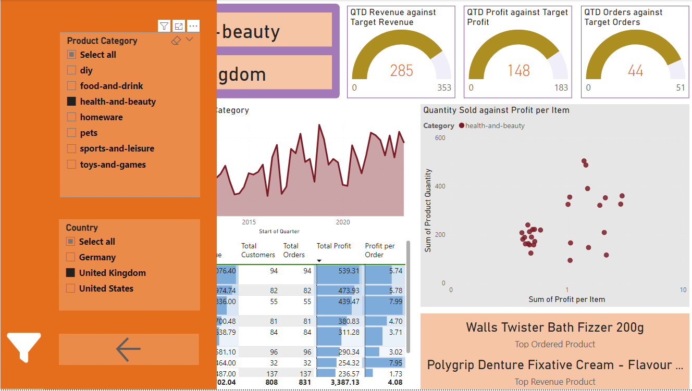
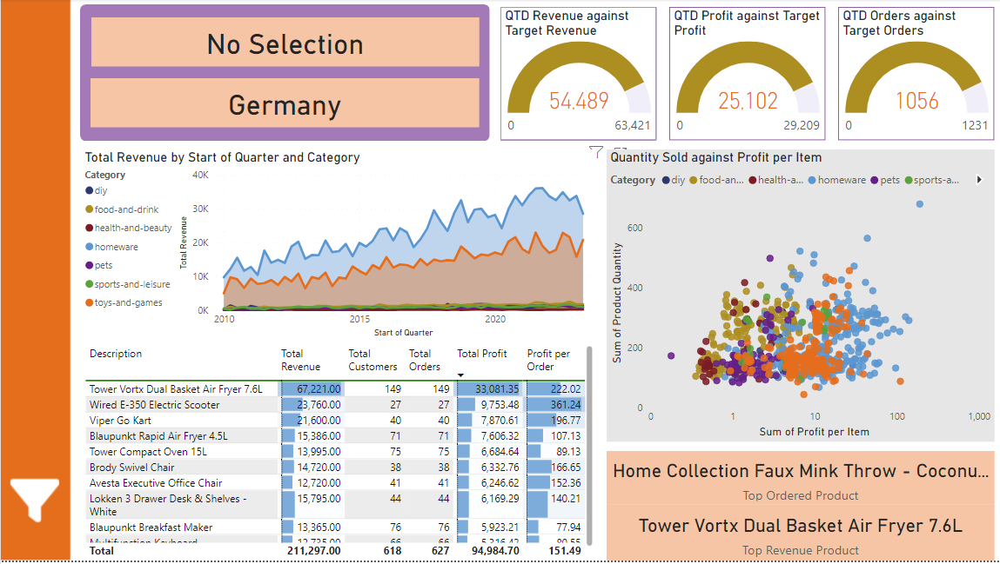

## Project Description

## Project Stages

### 1. Data Imports
Each of the tables *Orders*, *Products*, *Stores*, and *Customers* is imported into the Power BI project from a different source.

- The *Orders* table is imported from the Azure SQL Database using import mode. 

- The *Produts* table is imported from a local csv file.
- The *Stores* table is imported via an Azure Blob Sorage url. 
- The *Customers* table is imported by from a local folder containing three csv files which are combined into a single query. 

### 2. Data Transformations
The Power Query Editor is used to transform elements of each table before loading. 
#### Orders table:
- Each of the columns *Order Date* and *Shipping Date*, which initially contain both date and time, are split into two columns to separate date and time. 
- Missing values are removed from *Order Date* 

#### Products table:
- Initally the weight column contains both weight value and unit, with a variety of unit types. Several steps are implemented to convert all values to unit kilograms, and retain only numeric characters. 

#### Customers table:
- The column *Full Name* is created by combining *First Name* and *Last Name*.
- The column *Source.Name* is removed.

\
Across all tables column headings are adjusted for consistency and to fit Power BI naming conventions. 

### 3. Model Construction
Several steps are implemented to build out the data model for effective analysis.

#### Dates table:
- The table *Dates* is created with a continuous *Date* column using DAX: \
Dates = CALENDAR(DATE(YEAR(MIN(Orders[Order Date])), 1, 1),\
DATE(YEAR(MAX(Orders[Order Date])), 12, 31))

- The table *Dates* is built out with columns for *Day of Week*, *Month Number*, *Month Name*, *Quarter*, *Year*, *Start of Year*, *Start of Quarter*, *Start of Month* and *Start of Week*.

#### Table relationships:
The following many to one (left to right) relationships were created between tables:

- Orders[Product Code] to Products[Product Code]

- Orders[Store Code] to Stores[Store Code]
- Orders[User ID] to Customers[User UUID]
- Orders[Order Date] to Date[Date]
- Orders[Shipping Date] to Date[Date]

Between the last two relationaships indicates above, Orders[Order Date] to Date[Date] was marked as the active relationaship. 

A screenshot of the data model star schema can be seen below \
\

#### Measures table

A separate *Measures table* was created in the Power Query Editor.
\
Several key measures were calculated using DAX:

- Total Orders = COUNT(Orders[User ID])

- Total Customers = DISTINCTCOUNT(Orders[User ID])
- Total Quantity = SUM(Orders[Product Quantity])
- Total Revenue = SUMX(Orders, Orders[Product Quantity] * RELATED('Products'[Sale Price]))
- Total Profit = SUMX(Orders, Orders[Product Quantity] * (RELATED('Products'[Sale Price]) - RELATED('Products'[Cost Price])))
- Revenue YTD = TOTALYTD([Total Revenue], Dates[Date])
- Profit YTD = TOTALYTD([Total Profit], Dates[Date])

#### Date and geography hierarchies

The following date hierarchy was created:\
Start of Year > Start of Quarter > Start of Month > Start of Week > Date

The following geography hierarchy was created:\
World Region (Continent) > Country > Country Region

### 4. Report Construction

Four blank pages were created as the basis of the report - *Executive Summary*, *Customer Detail*, *Product Detail* and *Stores Map*

#### Customer Detail page 

The *Customer Detail* page is populated with several visuals to illustrate:
- Count of unique customers and revenue per customer (cards)

- Total customers by country (doughnut chart)
- Total customers by product category (column chart)
- Name of the customer with the highest revenue generation, and the total revenue and number of orders from that customer (cards).
- The top 20 customers filtered by total revenue (table). Rows in the *Total Revenue* column are formatted to show bars indicating total revenue values. The table and applied filtering can be seen below.

- Total customers against time period (line chart). The chart is formatted to allow drill down to the month level, and includes a forcast for the next 10 periods.

A slicer is included, allowing the user to filter the data by year. 

The orange bar to the left of the page is to become the page navigation bar. 
An example of the final page layout can be seen below:

#### Executive Summary

The *Executive Summary* page is popolulated with several visuals to illustrate:

- Total Revenue, Total Profit and Total Orders (card visuals).

- Total Revenue agaist time - Start of Year/Quarter/Month (line chart with drill down to the Start of Month level).
- Total Revenue by Country and Store Type (donut charts).

- Orders by Product Category (bar chart).
- KPIs:\
    Measures are created for *Previous Quarter Revenue*, *Previous Quarter Profit* and *Previous Quarter Orders* using DAX; for example:
    \
    \
    Previous Quarter Revenue = CALCULATE([Total Revenue], FILTER('Dates', DATEADD('Dates'[Start of Quarter], -1, QUARTER)))

    Subsequently, measures for *Target Revenue*, *Target Profit* and *Target Orders* are created based on a 5% increase on the previous quarter, using DAX; for example: 
    \
    \
    Target Revenue = [Previous Quarter Revenue] * 1.05

    Current total quarterly revenue / profit / orders are shown against target revenue / profit / orders in three KPI visuals. 

- Top 10 products with number of orders, total revenue and total profit (table).

An example of the Executive Summary page can be seen below: 

#### Product Detail page

The *Product Detail* page is populated with several visuals to illustrate:
- The quarter-to-date orders, revenue and profit against their respective targets (10% growth on the previous quarter) - gauge visuals. 
    - For each metric, three new DAX measures are created, for example: \
    \
    Last Quarter Revenue = CALCULATE([Total Revenue], DATESINPERIOD('Dates'[Date], LASTDATE(Orders[Order Date]), -1, QUARTER))
    \
    \
    Quarter Target Revenue = [Last Quarter Revenue] * 1.1
    \
    \
    QTD Revenue = CALCULATE([Total Revenue], DATESQTD(Orders[Order Date]))
    
    
- Total revenue against start of quarter (date), grouped by product category - area chart. 
- The top 10 products with total revenue, total customers, total orders and profit per order - table. \
Profit per order is defined by: \
Profit per Order = DIVIDE([Total Profit], [Total Orders])
- Quantity sold against profit per item for each product, grouped by product category - scatter chart. \
Profit per item is defined as a new column in the Products table by: \
Profit per Item = Products[Sale Price] - Products[Cost Price]

A slicer toolbar is created containing two slicers allowing product category and store country selection. The slicers are grouped on top of a rectagle constituting the toolbar. Two bookmarks are created, one in which the toolbar is visible and one in which it is hidden. A button is included on the toolbar and assiged the action of hiding the toolbar by association with the "slicer bar closed" bookmark. Similarly, a button is placed on the navigation bar and assigned the action of switching to the "slicer bar open" bookmark. 

The below image shows and example of the slicer toolbar setup.

Cards are added to the top left of the page to indicate the filter states for product category and store country. 

Cards are added to the lower right of the page to indicate the most ordered product and the product generating the highest revenue, within the filter contexts. \
\
An example of the final page layout can be seen below. 

#### Stores Map

The stores map page contains a large map of stores by Geography Hierarchy (World Region - Country - Country Region) with bubble size proportional to year-to-date profit. A slicer visual in Tile Mode allows rapid filtering by country, including a "Select all" option. The visual is connected to a tooltip page "Stores Tooltip" that displays the year-to-date profit against the profit goal in a gauge visual. 

#### Stores Tooltip
 The Stores Tooltip page displays the year-to-date profit against the profit goal in a gauge visual. The profit goal is defined as a 20% increase in profit over the previous year, and is defined in two stages using DAX:\
 \
Previous Year Profit = CALCULATE([Total Profit], PREVIOUSYEAR(Dates[Date]))\
\
Profit Goal = [Previous Year Profit] * 1.2

#### Stores Drillthrough

